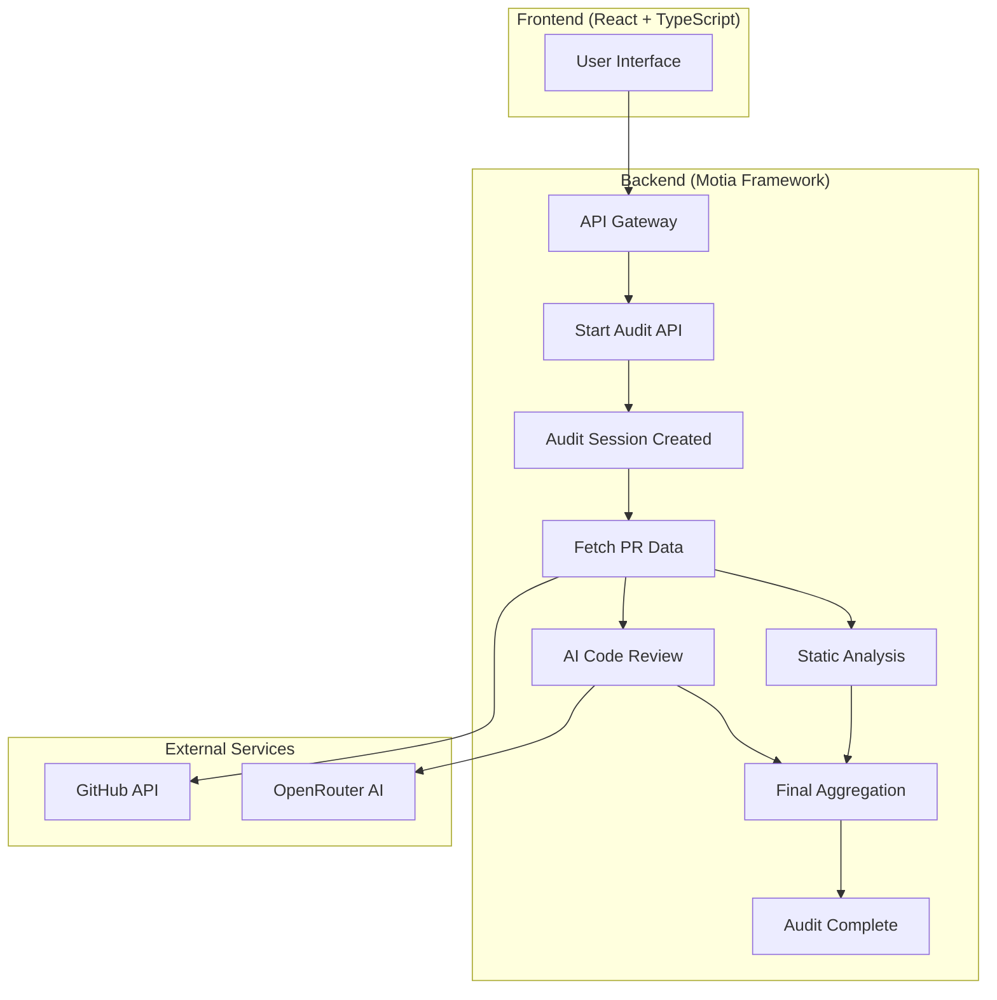

# GitFlow AI 🤖

**Autonomous PR Auditor** - AI-powered code analysis and security scanning for GitHub pull requests. Built with event-driven architecture using the Motia framework.

[](https://www.typescriptlang.org/)
[](https://reactjs.org/)
[](https://motia.dev/)
[](https://openrouter.ai/)
[](https://tailwindcss.com/)

## ✨ What is GitFlow AI?

GitFlow AI is an autonomous pull request auditor that performs comprehensive code analysis using cutting-edge AI technology. It combines static security scanning, AI-powered code review, and real-time visualization to deliver authoritative audit verdicts that help teams make confident merge decisions.

**Problem Solved**: Manual PR reviews are time-consuming, inconsistent, and often miss critical issues. GitFlow AI provides automated, consistent, and intelligent analysis that goes beyond traditional linting tools.

## 🚀 Key Features

- **🤖 AI-Powered Code Review**: Uses OpenRouter's Qwen/Qwen3-Coder model for comprehensive analysis
- **🔒 Security Scanning**: Detects secrets, vulnerabilities, and security issues
- **📊 Multi-Category Scoring**: Code quality, security, performance, and best practices
- **⚡ Real-Time Streaming**: Live progress updates with WebSocket integration
- **🎨 Interactive Visualization**: React Flow diagram showing audit workflow
- **🎯 Smart Verdict Logic**: Safe/Needs Changes/Blocked decisions with confidence scores
- **🔄 Event-Driven Architecture**: Built with Motia framework for scalability
- **💾 State Management**: Redis-backed session persistence across distributed steps

## 🏗️ Architecture



### Workflow Steps

1. **API Step**: Receives audit request, validates inputs, creates session
2. **Event Step**: Fetches PR data and files from GitHub API
3. **Event Step**: Performs static analysis for secrets and vulnerabilities
4. **Event Step**: Uses AI to review code quality across multiple categories
5. **Event Step**: Aggregates all results into final verdict

## 🛠️ Tech Stack

### Backend
- **Motia Framework**: Unified backend with APIs, events, state, and streaming
- **BullMQ**: Redis-based queue for reliable background job processing
- **TypeScript**: Type-safe development with auto-generated types
- **Zod**: Runtime type validation and schema definitions

### Frontend
- **React 19**: Modern React with hooks and concurrent features
- **React Flow**: Interactive workflow visualization
- **Tailwind CSS**: Utility-first CSS framework
- **Vite**: Fast build tool and development server

### AI & APIs
- **OpenRouter**: Multi-model API for AI code analysis
- **GitHub API**: Repository and pull request data
- **WebSocket**: Real-time streaming with Motia streams

## 🚀 Quick Start

### Prerequisites

- Node.js 18+
- npm or yarn
- OpenRouter API key ([get one here](https://openrouter.ai/))
- GitHub repository access (public repos supported)

### Installation

```bash
# Clone the repository
git clone https://github.com/yourusername/gitflow-ai.git
cd gitflow-ai

# Install dependencies
npm install

# Start development servers
npm run dev
```

This starts both the Motia backend (port 3001) and Vite frontend (port 5173).

### Usage

1. **Open the application** at `http://localhost:5173`
2. **Enter repository URL** (e.g., `https://github.com/microsoft/vscode`)
3. **Select pull request** from the dropdown (fetches open PRs automatically)
4. **Enter OpenRouter API key** for AI analysis
5. **Click "Start AI Audit"** to begin the analysis
6. **Watch real-time progress** in the interactive workflow diagram
7. **View final verdict** with detailed analysis and recommendations

## 📡 API Endpoints

### Start Audit
```http
POST /api/audit/start
Content-Type: application/json

{
  "repositoryUrl": "https://github.com/owner/repo",
  "prNumber": 123,
  "openRouterKey": "sk-or-v1-xxxxx"
}
```

**Response:**
```json
{
  "sessionId": "audit_1234567890_abc123",
  "message": "Audit session started successfully",
  "prCount": 5
}
```

### Get Pull Requests
```http
GET /api/pull-requests?repositoryUrl=https://github.com/owner/repo
```

### Get Session Status
```http
GET /api/audit/session/{sessionId}
```

## 🏃‍♂️ Development

### Available Scripts

```bash
# Development servers
npm run dev              # Start both frontend and backend
npm run dev:backend      # Motia backend only
npm run dev:frontend     # Vite frontend only

# Production
npm run build           # Build for production
npm run start           # Start production server

# Development tools
npm run generate-types   # Generate TypeScript types from Motia steps
npm run clean           # Clean build artifacts
```

### Project Structure

```
gitflow-ai/
├── src/
│   ├── api/                    # HTTP API steps
│   │   ├── start-audit.step.ts
│   │   ├── get-session.step.ts
│   │   └── get-pull-requests.step.ts
│   ├── events/                 # Background processing steps
│   │   ├── fetch-pr-data.step.ts
│   │   ├── static-analysis.step.ts
│   │   ├── ai-code-reviewer.step.ts
│   │   └── final-aggregation.step.ts
│   ├── frontend/               # React application
│   │   ├── App.tsx
│   │   ├── pages/
│   │   │   ├── Home.tsx
│   │   │   └── AuditFlow.tsx
│   │   ├── components/
│   │   │   ├── AuditNode.tsx
│   │   │   └── AnalysisDetailModal.tsx
│   │   └── services/
│   ├── streams/                # Real-time data streams
│   │   └── audit-progress.stream.ts
│   ├── types/                  # TypeScript definitions
│   │   └── audit.ts
│   ├── utils/                  # Utility functions
│   │   ├── github.ts
│   │   └── openrouter.ts
│   ├── errors/                 # Error handling
│   │   └── base.error.ts
│   └── services/               # Business logic (DDD pattern)
├── motia.config.ts             # Motia configuration
├── tailwind.config.js
├── tsconfig.json
└── package.json
```

## 🔧 Configuration

### Motia Configuration (`motia.config.ts`)

```typescript
export default config({
  plugins: [
    observabilityPlugin,    // Monitoring and metrics
    statesPlugin,          // Redis state management
    endpointPlugin,        // HTTP endpoints
    logsPlugin,           // Structured logging
    bullmqPlugin          // Queue management
  ]
})
```

### Environment Variables

Create a `.env` file for local development:

```env
# OpenRouter API (required for AI features)
OPENROUTER_API_KEY=sk-or-v1-xxxxx

# Redis (optional - defaults to embedded)
REDIS_URL=redis://localhost:6379

# GitHub (optional - uses public API by default)
GITHUB_TOKEN=github_pat_xxxxx
```

## 🤝 Contributing

1. Fork the repository
2. Create a feature branch: `git checkout -b feature/amazing-feature`
3. Commit your changes: `git commit -m 'Add amazing feature'`
4. Push to the branch: `git push origin feature/amazing-feature`
5. Open a Pull Request

### Development Guidelines

- **TypeScript**: Strict type checking enabled
- **ESLint**: Code linting and formatting
- **Prettier**: Consistent code formatting
- **Testing**: Write tests for new features
- **Documentation**: Update README for API changes

## 📄 License

This project is licensed under the MIT License - see the [LICENSE](LICENSE) file for details.

## 🙏 Acknowledgments

- **Motia Framework**: For the amazing unified backend framework
- **OpenRouter**: For providing access to multiple AI models
- **React Flow**: For the beautiful workflow visualization
- **Tailwind CSS**: For the utility-first CSS framework

## 📞 Support

- **Issues**: [GitHub Issues](https://github.com/yourusername/gitflow-ai/issues)
- **Discussions**: [GitHub Discussions](https://github.com/yourusername/gitflow-ai/discussions)
- **Discord**: Join our community on [Discord](https://discord.gg/gitflow-ai)

---

**Built with ❤️ for hackathons and modern development teams**
